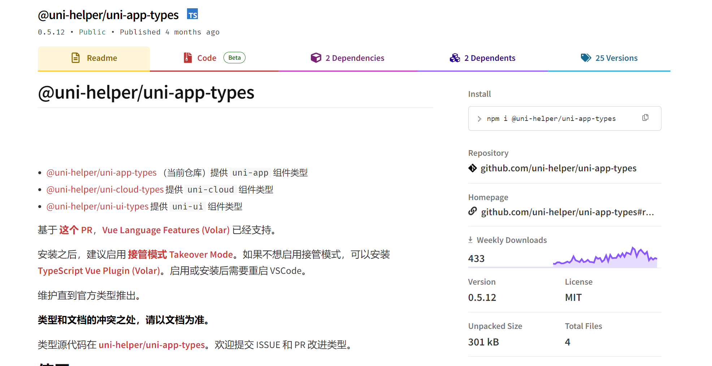

## 项目简 1. 安装依赖

```shell
# npm
npm i --registry=https://registry.npmmirror.com

# pnpm
pnpm i --registry=https://registry.npmmirror.com
```

2. 运行程序

```shell
# 微信小程序端
npm run dev:mp-weixin

# H5端
npm run dev:h5

# App端
需 HbuilderX 工具，运行 - 运行到手机或模拟器
```

3. 微信开发者工具导入 `/dist/dev/mp-weixin` 目录

### 工程结构解析

```
├── .husky                     # Git Hooks
├── .vscode                    # VS Code 插件 + 设置
├── dist                       # 打包文件夹（可删除重新打包）
├── src                        # 源代码
│   ├── components             # 全局组件
│   ├── composables            # 组合式函数
│   ├── pages                  # 主包页面
│       ├── index               # 首页
│       ├── category            # 分类页
│       ├── cart                # 购物车
│       ├── my                  # 我的
│       └── login               # 登录页
│   ├── services               # 所有请求
│   ├── static                 # 存放应用引用的本地静态资源的目录
│       ├── images              # 普通图片
│       └── tabs                # tabBar 图片
│   ├── stores                 # 全局 pinia store
│       ├── modules             # 模块
│       └── index.ts            # store 入口
│   ├── styles                 # 全局样式
│       └── fonts.scss          # 字体图标
│   ├── types                  # 类型声明文件
│       └── component.d.ts      # 全局组件类型声明
│   ├── utils                  # 全局方法
│   ├── App.vue                # 入口页面
│   ├── main.ts                # Vue初始化入口文件
│   ├── pages.json             # 配置页面路由等页面类信息
│   ├── manifest.json          # 配置appid等打包信息
│   └── uni.scss               # uni-app 内置的常用样式变量
├── .editorconfig              # editorconfig 配置
├── .eslintrc.cjs              # eslint 配置
├── .prettierrc.json           # prettier 配置
├── .gitignore                 # git 忽略文件
├── index.html                 # H5 端首页
├── package.json               # package.json 依赖
├── tsconfig.json              # typescript 配置
└── vite.config.ts             # vite 配置
```


### uniapp 使用 ts 类型检测



# 安装依赖

npm i -D @uni-helper/uni-app-types

# 配置 tsconfig.json，确保 compilerOptions.types 中含有 @dcloudio/types 和 @uni-helper/uni-app-types 且 include 包含了对应的 vue 文件
